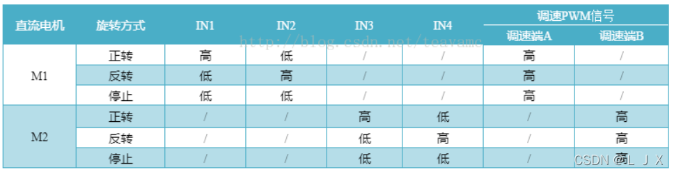

# 智能猫砂盆

> TPYBoardV202
> 开发环境：python

# 刷入MicroPython固件

下载固件https://micropython.org/download/esp8266/

```shell
esptool.py --port COM9 erase_flash
```

```shell
esptool.py --port COM9 --baud 460800 write_flash --flash_size=detect 0 D:\MicroPython开发板\TPYBoardv202资料\TPYBoardv202资料\固件和烧写工具\esp8266-20220618-v1.19.1.bin --verify
```


### 1、移动检测（_加速度传感器_）

### 2、温湿度检测（_温湿度传感器_）

### 3、距离检测（_超声波传感器_）

|TPYBoard v202|超声波模块（HC-SR04）|
|-------------|-------------------|
|+5V |Vcc|
|G14| Trig|
|G15| Echo|
|GND|Gnd|

- 工作原理

(1) 采用IO口Trig触发测距，给最少10us的高电平信号。

(2) 模块自动发送 8 个 40khz 的方波，自动检测是否有信号返回。

(3) 有信号返回，通过 IO 口 Echo 输出一个高电平，高电平持续的时间就是超声波从发射到返回的时间。测试距离=(高电平时间*声速(340M/S))/2。

- 代码实例

```python
def distance_measurement():
    # 高电平发送方波 持续20us
    Trig.value(1)
    time.sleep_us(20)
    Trig.value(0)
    # 侦听Echo串口有无输入高电平 没有的话接着发送方波
    while Echo.value() == 0:
        Trig.value(1)
        time.sleep_us(20)
        Trig.value(0)
    # 侦听到Echo电平升高
    if Echo.value() == 1:
        # 记录当前时间
        ts = time.ticks_us()

        while Echo.value() == 1:
            pass
        te = time.ticks_us()
        # 计算得到高电平持续时间 单位：us
        tc = te - ts
        # 根据音速计算距离（换算cm）常温常压下 0.0343厘米/微秒
        distance = (tc * 0.0343) / 2
        print('Distance:', distance, '(cm)')
```

- 误差分析

> 超声波的传播速度受空气的密度所影响，空气的密度越高则超声波的传播速度就越快，而空气的密度又与温度有着密切的关系

超声波`速度与温度`的关系近似公式为：_C=C0+0.607×T℃ (C0为零度时的声波速度332m/s)_

### 4、猫砂盆门控制（_舵机_）

### 5、猫砂自动清筛（_步进电机_、_带减速器电机_、_滑轨_、_皮带_）

### 6、本地监控显示器（_0.96寸OLED显示屏_）

> 常用方法

|方法|解释|
|---|---|
|text(string, x, y)|在(x, y)处显示字符串，注意text()函数内置的字体是8x8的，暂时不能替换|
|poweroff()|关闭OLED显示|
|poweron()|空函数，无任何效果。可以用 write_cmd(0xAF) 代替|
|fill(n)|n=0，清空屏幕，n大于0，填充屏幕|
|contrast()|调整亮度。0最暗，255最亮|
|invert()|奇数时反相显示，偶数时正常显示|
|pixel(x, y, c)|在(x, y)处画点|
|show()|更新显示内容。前面大部分函数只是写入数据到缓冲区，并不会直接显示到屏幕，需要调用show()后才能显示出来。|
|framebuf.line(x1,y1,x2,y2,c)|画直线|
|framebuf.hline(x,y,w,c)|画水平直线|
|framebuf.vline(x,y,w,c)|画垂直直线|
|framebuf.fill_rect(x,y,w,h,c)|画填充矩形|
|framebuf.rect(x,y,w,h,c)|画空心矩形|

### 7、远程状态监控（_Lua或Java或python开发_）

### 8、无线传输（_板载wifi模块_）

### 9、远程控制协议（_客户端加密的UDP协议_）

### 10、减速电机（L298N控制器）

> 接线图


### ESP8266引脚图


```text
作为输入输出引脚都适合:
GPIO0（D3）:连接到NODEMCU为代表的FLASH按键开关上，作为输入时上拉，作为输出时是推荐作为输出引脚的。如果引脚被拉低则无法启动；

GPIO2（D4）:作为输入时上拉，作为输出时是推荐作为输出引脚的。模块/开发板启动的时候会被置高，连接到板载LED灯上，跟GPIO0引脚一样，引脚拉低的时候，模块/开发板无法启动；

GPIO0/2引脚小结：跟启动相关，开发板/模块启动时都会被置高，如果被拉低则无法启动。推荐适合作为输出引脚。


GPIO1（TX）:UART串口通讯的接收引脚TX，能作为输出引脚但不大推荐作为输出引脚使用，模块/开发板启动的时候会被置高，被拉低时模块/开发板无法启动；调试输出引脚；

GPIO3（RX）:UART串口通讯的接收引脚RX，能作为输出引脚但不大推荐作为输出引脚使用，模块/开发板启动的时候会被置高；

GPIO1/3引脚小结：UART串口通讯的收发引脚，开发板/模块启动时都会被置高，被占用和错误操作的拉低会影响启动。推荐作为串口UART通讯引脚而不作他用。

GPIO4（D2）:作为输入输出引脚都适合，通常被用作I2C的数据引脚，同时引脚还支持PWM输出；

GPIO5（D1）:作为输入输出引脚都适合，通常被用作I2C的时钟引脚；

GPIO4/5引脚小结：I2C的时钟和数据引脚，同时也适合别作他用，用作输入输出引脚，同时4号脚支持PWM输出；

GPIO6-11 未在此图中被引出，因为它们用于连接大多数模块上的闪存芯片。如果将这些引脚用作 IO 使用将会导致程序崩溃。

需要注意的是，某些开发板和模块（ESP-12ED、NodeMCU 1.0）也会断开引脚 9 和 11。如果烧录芯片在 DIO 模式下工作（而不是 QIO，这是默认模式），则这些可以用作 IO。

GPIO6~11引脚小结：这些引脚是板载的存储操作引脚。通常就直接都没给引出来，想用也用不到，无需关心就别想了吧。在NODEMCU上，这些引脚实际上是被引出的，对应开发板S3,S2,S1,SC,S0,SK。建议慎重使用或者干脆无视。


GPIO12（D6）:做输入输出引脚都合适，做SPI通讯数据引脚（MISO），同时引脚还支持PWM输出；

GPIO13（D7）:做输入输出引脚都合适，做SPI通讯数据引脚（MISO）；

GPIO14（D5）:做输入输出引脚都合适，做SPI通讯时钟引脚（SCLK），同时引脚还支持PWM输出；

GPIO15（D8）:做输入时被拉低，可以但不推荐作为输出引脚，SPI通讯功能里的片选引脚（CS），同时引脚还支持PWM输出；

GPIO12~15引脚小结：SPI引脚，除了15引脚作为片选引脚不能作为输入输出引脚，其他引脚都可作为输入输出，12、14、15引脚支持PWM输出；

GPIO16（D0）:作为输入时无中断功能，作为输出的时候不支持I2C，PWM功能，同时在启动的时候也会被置高，用作从睡眠模式唤醒的功能引脚；不推荐作他用；

A0:模拟输入引脚，不能作为其他用途，A0引脚如果被频繁调用会影响模块正常工作，调用频率要求间隙时间大于5毫秒以保证模块工作正常；

另外需要注意的是A0引脚模块默认情况下读取电压范围只有0~1V，有些开发板会增加外围分压电路，建议在使用前做一个简单的读取测试，如：给个0.5V的电压到A0脚，如果读取值是512，则说明A0脚外围无外加的分压电路，允许的模拟量输入范围就是0~1V。
```


# PushDeer

> `PushDeer`可以将消息推送到各种支持MQTT协议的智能设备。  
> DeerESP 是 PushDeer 在 IOT 方向的扩展项目，它是一个基于 ESP8266/ESP32 芯片的消息设备方案。  
> 开发环境：arduino  
> DIE下载：https://www.arduino.cc/en/software  
> 1.44TFT资料：http://www.lcdwiki.com/zh/1.44inch_SPI_Arduino_Module_Black_SKU:MAR1442

### ESP8266与1.44TFT


### 开发流程

- 由于我们使用的8266并没有内置到 ardunio IDE 中，我们还需要进行一下配置，在设置界面填上附加开发板管理器网址：

> esp8266 填写这个 https://arduino.esp8266.com/stable/package_esp8266com_index.json  
> esp32 填写这个 https://raw.githubusercontent.com/espressif/arduino-esp32/gh-pages/package_esp32_index.json

# L298N（红版）

- 电机控制器，连接12V输出的2100mA电池，5V输出可以连接esp8266使用

# 智能小车开发

### 硬件模块

- 超声传感器，避障，回传位置信息
- L298N驱动板，驱动四个电机，分压给esp供电
- 舵机，180°舵机控制传感器转向角度
- esp8266，主控，开机配网
- 0.96寸OLED显示屏，间歇显示配网后的ip地址，方便手机发送udp数据包控制小车
- N20减速电机，连接12V电源，120转速，扭矩比较大，速度慢但是动力强
- 亚克力板，做小车底板
- 12V输出的18650电池

### 软件模块

> 注意：代码越简单越好，尽量不做过度的包装

- pushdeer，及时推送消息到手机，比如配网后的ip地址或者障碍物检测消息主动推送到手机
- 控制器代码，整个小车的控制代码和操作界面

### 引脚连接图

1、 电机驱动模块控制


2、 电机驱动模块接线
> 说明：IN1 IN2 IN3 IN4逻辑输出口，其中IN1 IN2 控制一个电机的转动，IN3 IN4 控制另一个电机的转动，只要一个置高 一个置低，就可以让电机转动起来。


<table>
    <tr>
        <th>G(GPIO)</th>
        <th>D(Lable)</th>
        <th>IN(IN1~4)</th>
    </tr>
    <tr>
        <th>4</th>
        <th>2</th>
        <th>IN1</th>
    </tr>
    <tr>
        <th>5</th>
        <th>1</th>
        <th>IN2</th>
    </tr>
    <tr>
        <th>12</th>
        <th>6</th>
        <th>IN3</th>
    </tr>
    <tr>
        <th>13</th>
        <th>7</th>
        <th>IN4</th>
    </tr>
</table>