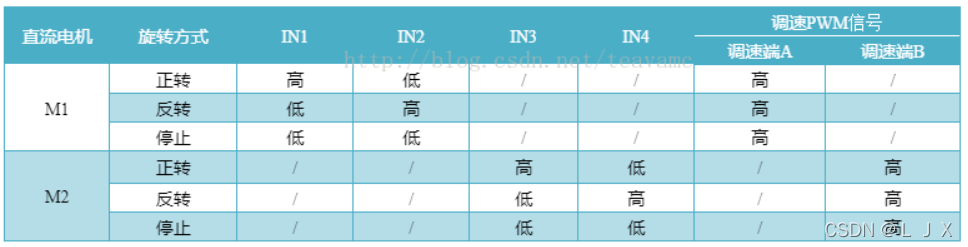

# 智能小车开发

### 硬件模块

- 超声传感器，避障，回传位置信息
- L298N驱动板，驱动四个电机，分压给esp供电
- 舵机，180°舵机控制传感器转向角度
- esp8266，主控，开机配网
- 0.96寸OLED显示屏，间歇显示配网后的ip地址，方便手机发送udp数据包控制小车
- N20减速电机，连接12V电源，120转速，扭矩比较大，速度慢但是动力强
- 亚克力板，做小车底板
- 12V输出的18650电池

### 软件模块

> 注意：代码越简单越好，尽量不做过度的包装

- pushdeer，及时推送消息到手机，比如配网后的ip地址或者障碍物检测消息主动推送到手机
- 控制器代码，整个小车的控制代码和操作界面

### 引脚连接图

1、 电机驱动模块控制

2、 电机驱动模块接线
> 说明：IN1 IN2 IN3 IN4逻辑输出口，其中IN1 IN2 控制一个电机的转动，IN3 IN4 控制另一个电机的转动，只要一个置高 一个置低，就可以让电机转动起来。

<table>
    <tr>
        <th>G(GPIO)</th>
        <th>D(Lable)</th>
        <th>IN(IN1~4)</th>
    </tr>
    <tr>
        <th>4</th>
        <th>2</th>
        <th>IN1</th>
    </tr>
    <tr>
        <th>5</th>
        <th>1</th>
        <th>IN2</th>
    </tr>
    <tr>
        <th>12</th>
        <th>6</th>
        <th>IN3</th>
    </tr>
    <tr>
        <th>13</th>
        <th>7</th>
        <th>IN4</th>
    </tr>
</table>

3、 超声传感器接线口

<table>
    <tr>
        <th>G(GPIO)</th>
        <th>D(Lable)</th>
        <th>IN(IN1~4)</th>
    </tr>
    <tr>
        <th>4</th>
        <th>2</th>
        <th>IN1</th>
    </tr>
    <tr>
        <th>5</th>
        <th>1</th>
        <th>IN2</th>
    </tr>
</table>